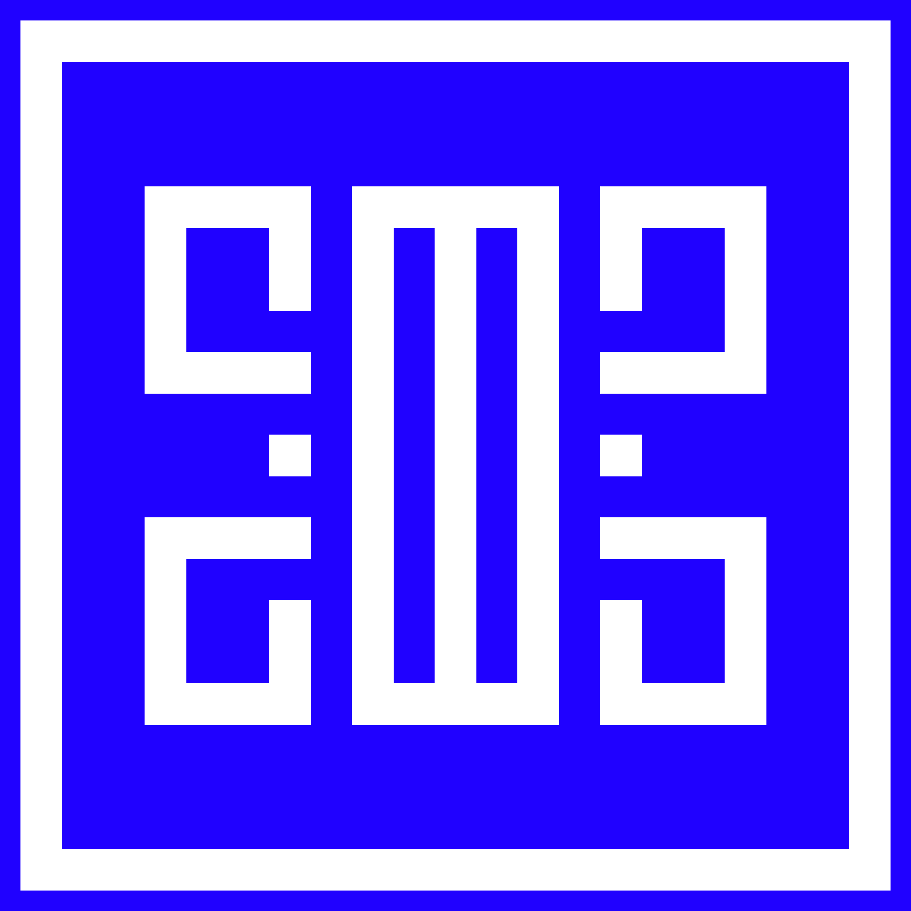

<div align="center">

# 🎨✨ Shivam M. Salunkhe | Portfolio

### *CGI & VFX Artist • AI Developer • Web App Creator*

[](https://smsx.netlify.app)
[](https://astro.build/)
[](https://www.typescriptlang.org/)
[](https://tailwindcss.com/)



*A cutting-edge portfolio showcasing the intersection of creative artistry and advanced technology*

</div>

---

## 🚀 About This Portfolio

This portfolio represents the perfect blend of **creative artistry** and **cutting-edge technology**. Built with modern web technologies, it showcases work spanning from CGI and VFX artistry to AI development and web applications.

**What makes this portfolio special:**
- 🎬 **CGI & VFX Showcase** - High-quality 3D renders and visual effects work
- 🤖 **AI Projects** - Advanced AI agents and prompt engineering solutions
- 🌐 **Web Applications** - Full-stack development with modern frameworks
- ⚡ **Performance Optimized** - Lightning-fast loading with Astro's island architecture
- 📱 **Responsive Design** - Seamless experience across all devices

## 🌟 Featured Projects

<table>
<tr>
<td align="center" width="50%">

### 🎯 Ren3der
*AI-Powered Rendering Platform*

[](https://ren3der.vercel.app/)

</td>
<td align="center" width="50%">

### 🦈 SharkSenz
*Advanced Analytics Solution*

[](https://sharksenz.vercel.app)

</td>
</tr>
</table>

## 🎨 Professional Highlights

- 🎵 **Collaborated with Alan Walker** - International music artist projects
- 🏢 **Future House Music (Rotterdam)** - Brand partnership and creative work
- 🤖 **Google A2A AI Agents** - Building next-generation AI solutions with ADK and MCP servers
- 🎓 **Dual Expertise** - Interior Design + Computer Applications background

## ✨ Portfolio Features

| Feature | Description |
|---------|-------------|
| 🎬 **3D Graphics Gallery** | Stunning CGI renders, VFX work, and 3D artistry |
| 💼 **Professional Experience** | Detailed work history and achievements |
| 🎯 **Skills Matrix** | Comprehensive technical and creative skill showcase |
| 📚 **Educational Background** | Academic credentials and certifications |
| 📱 **Contact Integration** | Multiple ways to connect and collaborate |
| 🌙 **Dark/Light Theme** | Adaptive design for optimal viewing |

## 🛠️ Tech Stack

<div align="center">

### Frontend & Framework


### Animation & Styling


### Development Tools


</div>


## 🚀 Quick Start

### Prerequisites
- Node.js (v18+ recommended)
- npm or yarn package manager

### Installation & Setup

```bash
# Clone the repository
git clone https://github.com/sms03/My-Portfolio-Resume-Astro.git

# Navigate to project directory
cd My-Portfolio-Resume-Astro

# Install dependencies
npm install
# or
yarn install

# Start development server
npm run dev
# or
yarn dev
```

🌐 **Development server will be running at:** `http://localhost:4321`

### Build for Production

```bash
# Create optimized production build
npm run build
# or
yarn build

# Preview production build locally
npm run preview
# or
yarn preview
```

## ⚙️ Customization Guide

### 🔧 Site Configuration
All main settings are centralized in `src/data/site-config.ts`:

```typescript
const siteConfig = {
  website: 'https://your-domain.com',
  title: 'Your Name',
  subtitle: 'Your Professional Title',
  description: 'Your portfolio description',
  // ... social links, navigation, etc.
}
```

### 📝 Content Management
| Content Type | Location | Description |
|--------------|----------|-------------|
| **Pages** | `src/content/pages/` | About, Skills, Experience, etc. |
| **Projects** | `src/content/projects/` | Portfolio project showcases |
| **3D Gallery** | `public/3d-art/` | CGI renders and artwork |
| **Resume** | `public/resume/` | Downloadable resume files |

### 🎨 Styling & Themes
- **Global Styles**: `src/styles/global.css`
- **Component Styles**: Individual `.astro` component files
- **Animations**: `src/utils/animation-utils.ts` (GSAP configurations)

## 🚀 Deployment Options

<div align="center">

| Platform | Status | Deploy Command |
|----------|--------|----------------|
| **Netlify** | ✅ Recommended | `npm run build` |
| **Vercel** | ✅ Supported | Auto-deploy on push |
| **GitHub Pages** | ✅ Compatible | Static build deployment |
| **Cloudflare** | ✅ Fast CDN | Edge deployment ready |

</div>

### Netlify Deployment (Recommended)
1. Connect your GitHub repository to Netlify
2. Build command: `npm run build`
3. Publish directory: `dist`
4. Deploy! 🚀

## 🤝 Connect & Collaborate

<div align="center">

### Let's Create Something Amazing Together!

[](https://smsx.netlify.app)
[](mailto:shivamsal2000@gmail.com)

[](https://github.com/sms03)
[](https://www.linkedin.com/in/sms03)
[](https://www.behance.net/SMSXART)

</div>

---

## 🏆 Achievements & Recognition

- 🎵 **International Collaboration** with Alan Walker
- 🏢 **Brand Partnership** with Future House Music, Rotterdam
- 🤖 **AI Innovation** in Google A2A development
- 🎨 **Creative Excellence** in CGI and VFX artistry
- 💻 **Technical Expertise** in full-stack development

## 📊 Project Stats

<div align="center">


</div>

## 📄 License

This project is licensed under the **MIT License** - see the [LICENSE](LICENSE) file for details.

<div align="center">

---

### 🙏 Acknowledgments

**Special Thanks To:**
- [JustGoodUI](https://github.com/JustGoodUI/dante-astro-theme) for the original Dante theme inspiration
- [Astro Team](https://astro.build/) for the incredible framework

---

<div>

**⭐ Found this helpful? Star the repository!**

**Made with ❤️ by [Shivam M. Salunkhe](https://smsx.netlify.app)**

*"Where Art Meets Technology"*

</div>

</div>